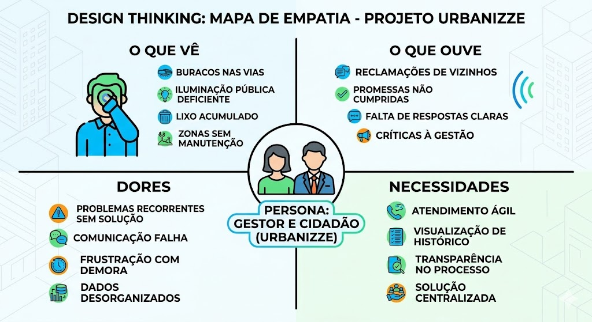

# Introdução

O projeto Urbanizze surge como uma iniciativa tecnológica voltada para a modernização da gestão de infraestrutura e serviços em contextos urbanos e comunidades planejadas. Em um cenário de crescimento acelerado das cidades, a manutenção de ativos públicos e o atendimento a demandas de zeladoria tornam-se desafios logísticos complexos.

Esta documentação apresenta a visão geral de uma plataforma projetada para integrar a comunicação entre usuários e gestores, estabelecendo objetivos claros de eficiência operacional e transparência. O projeto justifica-se pela necessidade de transformar processos tradicionalmente manuais em fluxos digitais auditáveis, tendo como público-alvo gestores públicos, administradores de condomínios e cidadãos engajados na melhoria do seu entorno.

## Problema
A gestão de manutenção urbana e predial enfrenta obstáculos críticos que impactam diretamente a qualidade de vida e a segurança dos usuários. O problema central reside na fragmentação e na informalidade do fluxo de informações. Atualmente, a identificação de falhas na infraestrutura — como problemas de iluminação, pavimentação ou saneamento — depende de processos reativos e, muitas vezes, sem registros centralizados.

Contexto
O cenário identificado envolve a utilização de canais de comunicação ineficientes (como ligações telefônicas isoladas ou mensagens informais), o que resulta em:

Perda de Rastreabilidade: Não há um histórico confiável sobre quando um problema foi reportado ou quem foi o responsável pela última intervenção.

Gargalos de Priorização: Sem dados consolidados, gestores não conseguem identificar quais áreas demandam atenção urgente, baseando-se em percepções subjetivas em vez de indicadores reais.

Desperdício de Recursos: A falta de planejamento preventivo, causada pela ausência de visão sistêmica, gera custos elevados com manutenções corretivas de emergência.

Neste contexto, as organizações (sejam prefeituras ou empresas de gestão patrimonial) operam com tecnologias limitadas a planilhas eletrônicas estáticas que não oferecem suporte à mobilidade ou à atualização em tempo real, dificultando a resolução ágil de incidentes que ocorrem dinamicamente no espaço urbano.

### Análise do Problema

Como parte do processo de entendimento profundo das dores dos usuários, o grupo realizou uma dinâmica de Design Thinking. O resultado está sintetizado no **Mapa de Empatia** abaixo, que destaca a frustração com os canais de comunicação ineficientes e a falta de rastreabilidade das demandas de infraestrutura urbanas.

  

> **Links Úteis**:
> - [Objetivos, Problema de pesquisa e Justificativa](https://medium.com/@versioparole/objetivos-problema-de-pesquisa-e-justificativa-c98c8233b9c3)
> - [Matriz Certezas, Suposições e Dúvidas](https://medium.com/educa%C3%A7%C3%A3o-fora-da-caixa/matriz-certezas-suposi%C3%A7%C3%B5es-e-d%C3%BAvidas-fa2263633655)
> - [Brainstorming](https://www.euax.com.br/2018/09/brainstorming/)

## Objetivos

Aqui você deve descrever os objetivos do trabalho indicando que o objetivo geral é desenvolver um software para solucionar o problema apresentado acima. 

Apresente também alguns (pelo menos 2) objetivos específicos dependendo de onde você vai querer concentrar a sua prática investigativa, ou como você vai aprofundar no seu trabalho.
 
> **Links Úteis**:
> - [Objetivo geral e objetivo específico: como fazer e quais verbos utilizar](https://blog.mettzer.com/diferenca-entre-objetivo-geral-e-objetivo-especifico/)

## Justificativa

Explique de forma clara a relevância da aplicação escolhida, justificando os objetivos específicos e os aspectos do software que serão aprofundados, e quantifique o impacto do problema com dados concretos (números, percentuais, indicadores) obtidos por bases oficiais ou outras fontes confiáveis, sempre citadas no padrão ABNT (no formato [Numérico] ou (AUTOR, ANO)).

**Relacione o problema aos Objetivos de Desenvolvimento Sustentável (ODS), indicando quais ODS e subobjetivos são atendidos e descrevendo como o projeto contribui para cada um deles, garantindo coerência entre o impacto mensurado e as metas selecionadas.**

> **Links Úteis**:
> - [Como montar a justificativa](https://guiadamonografia.com.br/como-montar-justificativa-do-tcc/)

## Público-Alvo

Descreva quem serão as pessoas que usarão a sua aplicação indicando os diferentes perfis. O objetivo aqui não é definir quem serão os clientes ou quais serão os papéis dos usuários na aplicação. A ideia é, dentro do possível, conhecer um pouco mais sobre o perfil dos usuários: conhecimentos prévios, relação com a tecnologia, relações hierárquicas, etc.

> **Links Úteis**:
> - [Público-alvo](https://blog.hotmart.com/pt-br/publico-alvo/)
> - [Como definir o público alvo](https://exame.com/pme/5-dicas-essenciais-para-definir-o-publico-alvo-do-seu-negocio/)
> - [Público-alvo: o que é, tipos, como definir seu público e exemplos](https://klickpages.com.br/blog/publico-alvo-o-que-e/)
> - [Qual a diferença entre público-alvo e persona?](https://rockcontent.com/blog/diferenca-publico-alvo-e-persona/)
